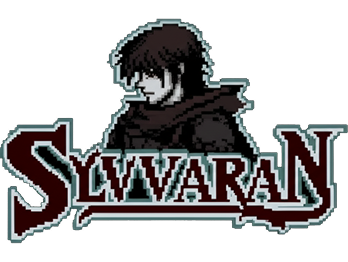

🌑 Sylvaran

“La luz se extinguió. La última llama aguarda al guardián.”

Sylvaran es un RPG de acción y fantasía oscura. Controlas a Kael, el último miembro de una orden extinta, en un mundo corrompido por la diosa caída Nihzara. Tu misión: purificar santuarios elementales y despertar una entidad primigenia que puede salvar el mundo... o condenarlo para siempre.

🧠 Estado del proyecto
Este repositorio no está listo para distribución o instalación automática. El juego se encuentra en una etapa de desarrollo activa, con enfoque en:

Diseño de mapas y assets modulares

Integración de animaciones y escenas base

Prototipo funcional del sistema de jugador

Creación de mecánicas narrativas y ambientales

🔮 Próximamente: documentación técnica, capturas del gameplay, y sistema interactivo de santuarios.

🎨 Dirección estética
🎭 Pixel art gótico inspirado en RPG clásicos

🕯️ Paleta tenue con atmósfera decadente

📜 UI retro con tipografía personalizada

🧩 Modularidad para escalabilidad futura

🗺️ Estructura del juego

assets/        → Arte, música, animaciones, mapas
src/
  scenes/      → Overworld, menú principal, transiciones
  config/      → Parámetros de mapas y sistemas
  objects/     → Jugador, NPCs, enemigos
  data/        → Inventario, historia, diálogo
  utils/       → UI, lógica común, helpers
public/        → Archivos estáticos (favicon, etc)
styles/        → Hojas de estilo CSS

📁 Organización modular: diseñada para facilitar cambios narrativos, mecánicas nuevas, o expansión multiregión sin romper la estructura actual.

🧩 Tecnologías base
Tecnología	Rol en el proyecto
🌀 Phaser	Motor principal de juego 2D
⚡ Vite	Bundler y entorno de desarrollo
🧠 JavaScript	Lógica del juego y control

✨ Mecánicas implementadas (prototipo)
🌍 Mapa navegable con capas múltiples

✨ Animaciones ambientales reactivas

🧍 Control de jugador y sistema de movimiento

🎶 Ambientación sonora en pruebas

🧭 Transiciones narrativas básicas

  

📜 Créditos e inspiración
🔹 Arte y música original

🐉 Influencias: Dark Souls, Diablo, RPG clásicos

⛓️ Estética: fantasía oscura, tipografía retro japonesa

🖤 Gracias por seguir el desarrollo de Sylvaran
Si te interesa el proceso creativo detrás del juego, ¡más actualizaciones pronto!